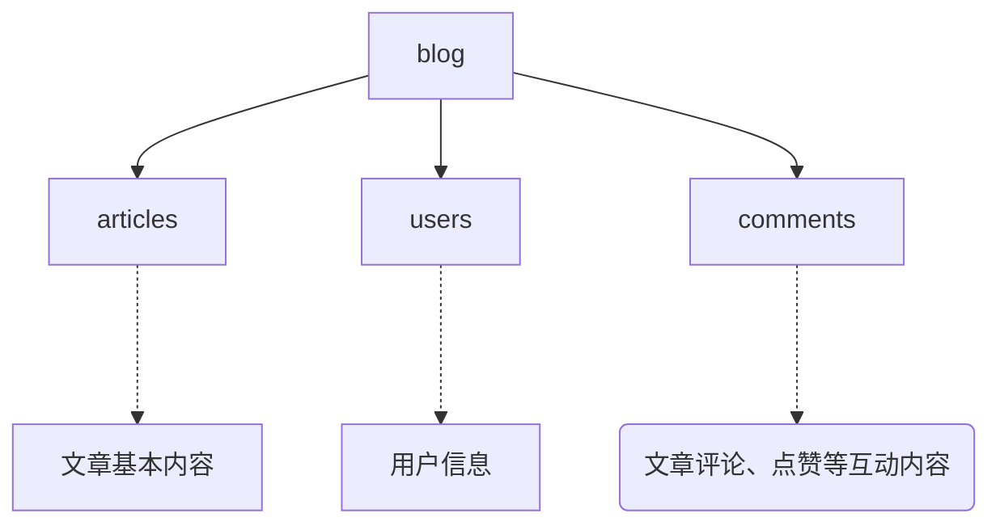

# Markdown-Blog
## 新生项目课程：云环境下基于Markdown的博客系统

### 项目需求:
- 高级权限管理：管理员(可攥稿)、普通用户
- md评论  
- 
...  

已完成：
 - [x] 账号管理：注册、登录、修改信息(待完善)
 - [x] 文章管理：发布、修改、删除、查看
 - [x] 互动功能：评论、回复、文章点赞

### 开发文档：
#### 数据库结构

#### apis
```mermaid
graph TD
    
```

### 注释：
mongoDB linker:
```
mongodb://my-mongo/TwlmBlog
```
available ports:
```
12301~12349
```