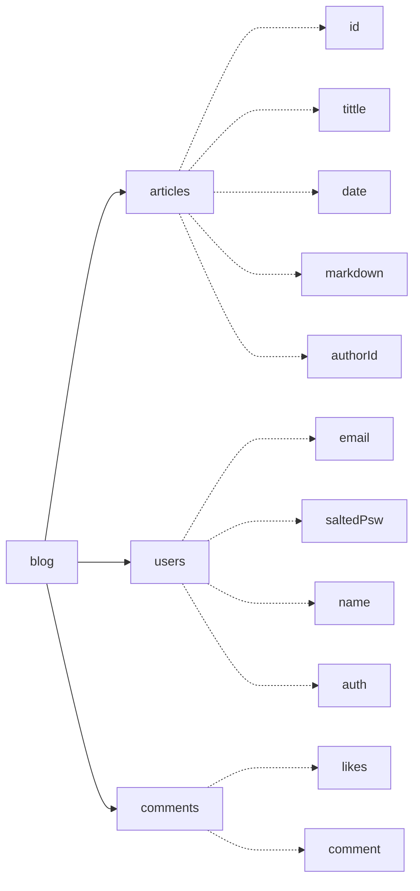
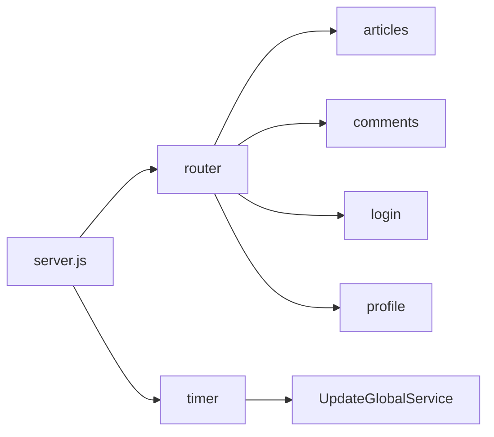
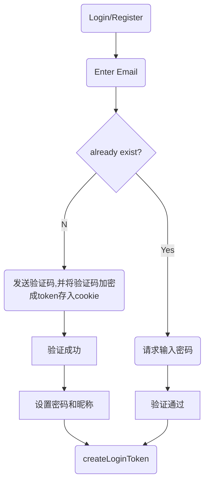
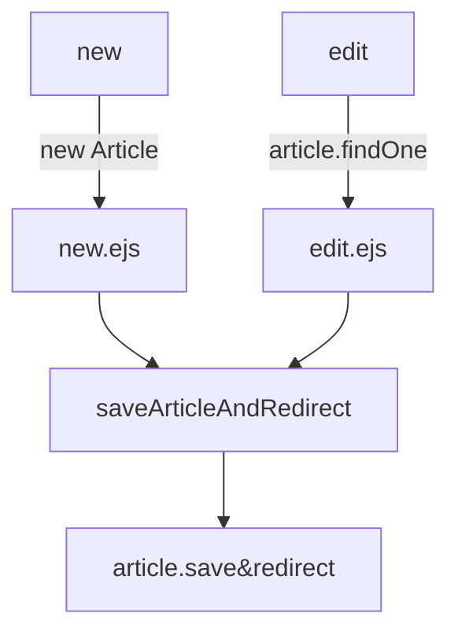

## Markdown-Blog
# 新生项目课程：云环境下基于Markdown的博客系统
## Runtime

~~这是一个使用远古技术栈的项目~~  
Server: Node.js  Express MongoDB  
Frontend: jQuery Bootstrap

## 主要功能
 - [x] 账号管理：注册、登录、重置、修改信息
 - [x] 文章管理：发布、修改、删除、查看
 - [x] 互动功能：评论、回复、文章点赞

## 开发文档：
### 数据库结构
使用了MongoDB 数据库模型位于models文件夹下

### apis
一些简陋的apis:
#### commentMng  评论管理
comment与article数据库独立，避免干扰，二者通过articleId关联
comments和likes是两个独立的集合，likes用于存储点赞的用户id
- getArticleComments:获取评论
```js
async function getArticleComments(articleId) {
    let comments = await commentDB.findOne({articleId: articleId});
    let commentsList = [];
    if (comments) {
        for (const comment of comments.comments) {
            commentsList.push({
               // id: comment._id,...
            });
        }
    }
    return {comments: commentsList, likeCount: comments ? comments.likes.length : 0};
}
```
- addComment:添加评论
- deleteComment:删除评论
- clearCommentsForArticle:清空文章所有评论
- setLikesForArticle:文章点赞
评论回复功能做的也比较简陋  只是在回复后插入新的评论而已..
```js
 if (replyTo != null) {
    //查找commendId为replyTo的评论
    let replyToIndex = 0;
    for (var i = 0; i < comments.comments.length; i++) {
        if (comments.comments[i]._id.toString() === replyTo) {
            replyToIndex = i;
            break;
        }
    }
    comments.comments.splice(i + 1, 0, item);
    item = comments.comments[i + 1];
} else {
    comments.comments.push(item);
    item = comments.comments[comments.comments.length - 1];
}
await comments.save();
return item;
```

#### articleMng  文章管理
在文章的增删查改的基础上新增加载md、评论、点赞、作者信息
- new
- get
- edit
- delete

#### loginAuth 登录验证
前端做了Js混淆和密码的AES加密，后端做了密码的SHA256加盐加密
验证通过的token通过cookie储存..  
这是一个简单暴力的方式，可能安全性并不高  
- signPsw 在数据库中存储的是加盐后的密码
```js
function signPsw(psw) {
    return crypto.createHash('md5').update(salt + psw).digest('hex');
}
```
- createLoginToken
```js
function createLoginToken(res, email, saltedPsw) {
    let token = crypto.createHash('sha256').update(salt + email + salt + saltedPsw).digest('hex');
    let conf = {httpOnly: true, secure: true, maxAge: 1000 * 60 * 60 * 24 * 7};
    res.cookie('loginToken', token, conf);
    res.cookie('email', email, conf);
}
```
- checkLoginToken
```js
async function checkLoginToken(cookies) {
    let result = {
        login: false,
        user: null
    };
    if (cookies.loginToken && cookies.email) {
        const User = require('../models/user');
        let user = await User.findOne({email: cookies.email});
        if (user) {
            let token = crypto.createHash('sha256').update(salt + cookies.email + salt + user.saltedPsw).digest('hex');
            if (token === cookies.loginToken) {
                result.user = user;
                result.login = true;
            }
        }
    }
    return result;
}
```
- packConfWith  
- reset 
router收到请求后会先通过cookie验证token,通过验证的token会再通过
packConfWith将登录信息附带参数传递给render并在前端做出相应的显示

#### userProfile 用户信息
- sendVerificationCode 发送验证码(用于注册和修改密码  似乎不是很好分类)
- get/setName 修改昵称

## 功能实现
#### Where app starts

#### 用户管理
注册、登录、修改信息：

验证登录信息： api经过封装，只需要
```js
const auth=require('../apis/loginAuth');
let authData=await auth.checkLoginToken(req.cookies);
if(authData.login){
    //do something
    //authData.user.email \ name ...
}
```
或者在router中:
```js
res.render('xxxxxurlxxxxx', await auth.packConfWith(req.cookies, {YOURDATA}));
```
修改名称：
```js
$.ajax({
    url:'/profile/',
    method:'POST',
    data:{
        method:"setName",
        newName:newName
    },
    success:(res)=> {
        if (res.success) {
            alert("succeeded to change your name to " + newName);
            $('#titleH1').html("Hello, " + newName);
            $('#loginUser').html(`welcome back, <a href="/profile/">` + newName.toString() + `</a>!&nbsp;`);
        }else{
            alert("failed to change you name");
        }
    }
});
```
重置密码:
```js
const resetHandler=async(req,res)=> {
    let loginData = await auth.checkLoginToken(req.cookies);
    let email = undefined;
    if (req.body.email)
        email = req.body.email;
    if (email) {
        const up = require('../apis/userProfile');
        let code = await up.sendVerificationCode(email);
        res.cookie('VerificationCode', auth.signPsw(code), {maxAge: 1000 * 60 * 5});
        res.render('account/login', {
            title:"Reset",
            psw: "",
            name: loginData.login ? loginData.user.name : "",
            login: false,
            exist: false,
            confirmed: true,
            email: email,
            msg: ""
        });
    } else {
        setGlobalEncoder();
        res.render('account/login', {title:"Reset",exist: false, confirmed: false, login: false, msg: "Verify your email:"});
    }
};
router.get('/reset',resetHandler);
router.post('/reset',resetHandler);
```

#### 文章管理
新增、修改文章：

查看文章；包括加载md、评论、点赞、作者信息
```js
let commentsData = await commentMng.getArticleComments(article._id);
let likeCount = commentsData.likeCount;

const {marked} = require('marked');
const createDomPurify = require('dompurify');
const {JSDOM} = require('jsdom');
const dompurify = createDomPurify(new JSDOM().window);
const usProf = require('../apis/userProfile');
article.sanitizedHtml = dompurify.sanitize(marked(article.markdown));
article.authorName = await usProf.getName(article.author);
res.render('articles/show', await auth.packConfWith(req.cookies, {
    article: article,
    comments: commentsData.comments,
    likes: likeCount
}));
```

#### 文章互动
评论、回复、点赞
前端:用ajax异步提交评论，成功后在dom中插入新的评论
```js
if(url.toString().includes('type=reply')) {
    var commentId = form.find('input[name="commentId"]').val();
    console.log(commentId);
    comList.find('.card-body').each(function () {
        if ($(this).find('p#commentItemId').text() === commentId) {
            $(this).parent().after(item);
            $("#myModal").modal('hide');
        }
    });
}else{
    comList.append(item);
}
```
点个赞
```js
    function like(articleId){
      $.ajax({
        url:'/comments/like',
        type:'POST',
        data:{articleId:articleId},
        success:function(data){
          $('#likeBtn').html(data.likes+'&nbsp;Likes');
        }
      });
    }
```
## 工作量统计
| 工作量统计表  |  基础功能    | 新增功能1    |   新增功能2    | 新增功能3   | 新增功能4    |   新增功能5    | 新增功能6   | 新增功能7    |
| -----------  | ----------- | ----------- | -----------    | ----------- | ----------- |-----------    |----------- |-----------  |
 描述 | 文章数据增删查改（已重构） | 多账号管理（注册、发邮、登录、重置、退出）|登录Token分发验证等加密措施| 文章互动功能（文章点赞、评论、回复评论） | 修改部分功能为异步请求 | 同步bing每日一图为背景 | 评论支持md、\<code\>块支持语法高亮 | CSS美化
| 学时 | 3 | 4|2 | 5 | 3 | 1 | 1 | 3


## 注释：
mongoDB linker:
```
mongodb://my-mongo/TwlmBlog
```
available ports:
```
12301~12349
```