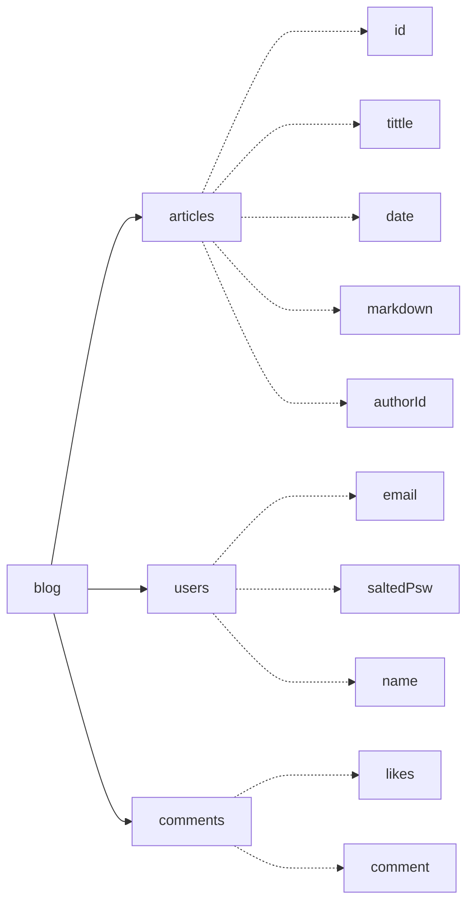

# Markdown-Blog
## 新生项目课程：云环境下基于Markdown的博客系统
#### Runtime

~~这是一个使用远古技术栈的项目~~  
Server: Node.js  Express MongoDB  
Frontend: jQuery Bootstrap

### 项目需求:
还需：
- 高级权限管理：管理员(可攥稿)、普通用户  
...  

已完成：
 - [x] 账号管理：注册、登录、修改信息(待完善)
 - [x] 文章管理：发布、修改、删除、查看
 - [x] 互动功能：评论、回复、文章点赞

### 开发文档：
#### 数据库结构

#### apis
一些简陋的apis:
##### commentMng  评论管理
comment与article数据库独立，避免干扰  
comments和likes是两个独立的集合，likes是一个数组，存储点赞的用户id
- getArticleComments:获取评论
- addComment:添加评论
- deleteComment:删除评论
- clearCommentsForArticle:清空文章所有评论
- setLikesForArticle:文章点赞
评论回复功能做的也比较简陋  只是在回复后插入新的评论而已..

##### articleMng  文章管理
原仓库并没有把routes和apis分开，这里做保留  
只是在get新增了加载md、评论、点赞、作者信息的功能
- new
- get
- edit
- delete

##### loginAuth 登录验证
前端做了Js混淆和密码的AES加密，后端做了密码的SHA256加盐加密
验证通过的token通过cookie储存..  
这是一个简单暴力的方式，可能安全性并不高  
- signPsw
- createLoginToken
- checkLoginToken
- packConfWith  
router收到请求后会先通过cookie验证token,通过验证的token会再通过
packConfWith将登录信息附带参数传递给render并在前端做出相应的显示

##### userProfile 用户信息
- sendVerificationCode 发送验证码(用于注册和修改密码  似乎不是很好分类)
- get/setName 修改昵称
### 注释：
mongoDB linker:
```
mongodb://my-mongo/TwlmBlog
```
available ports:
```
12301~12349
```